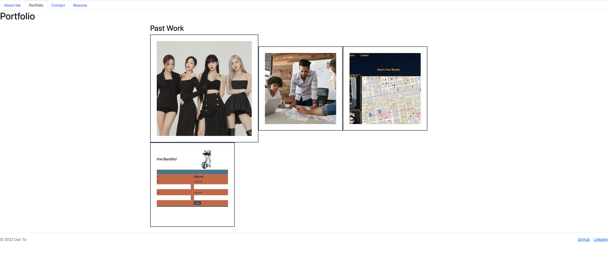

# 20 React: React Portfolio

This is an application showcasing my portfolio that started within the Berkeley Bootcamp. This app was created using React.js, which uses Javascript to create a user interface connected through core components and is dynamically updated no matter the state.

Link to the application: https://react-portfolio-20-dan.herokuapp.com/

